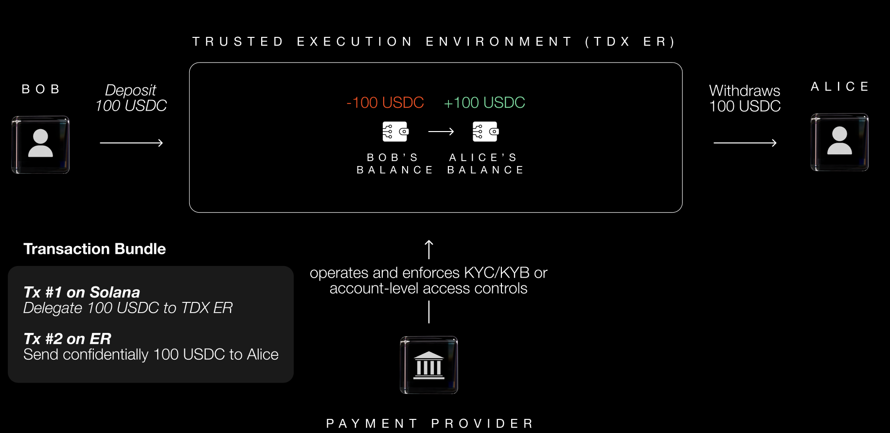
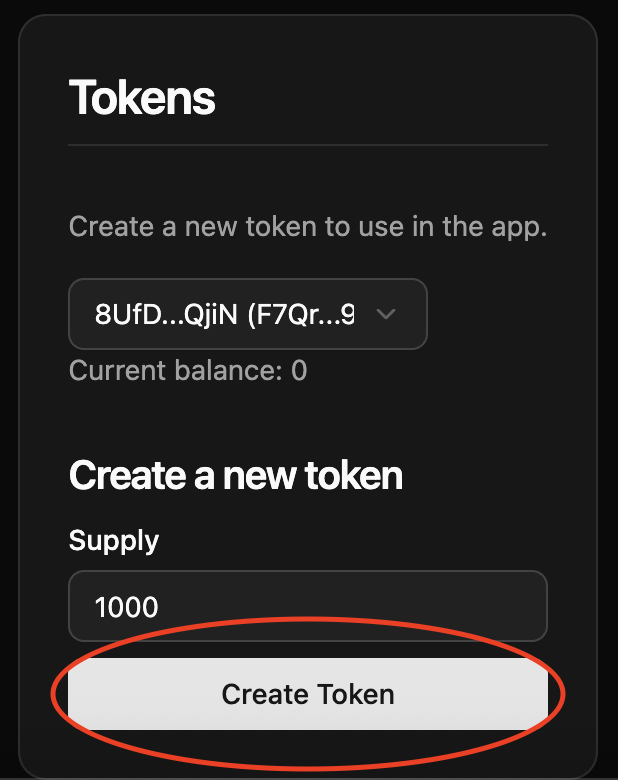
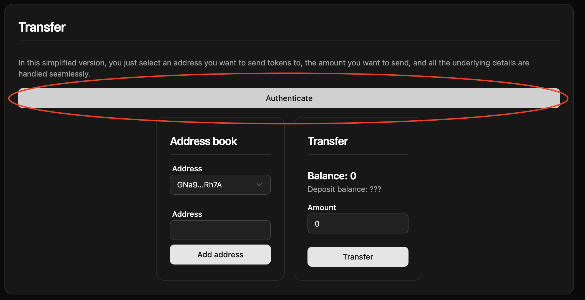
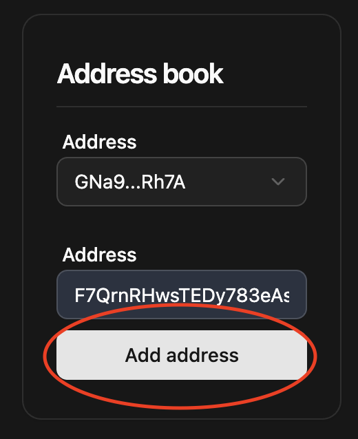
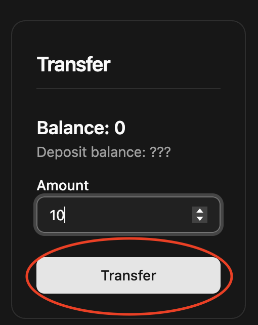

# Private Payments on Private Ephemeral Rollups (PER)

A simple payment app that works on Solana with Private Ephemeral Rollup (PER).

## Summary

- [Private Payments](#private-payments)
  - [Summary](#summary)
  - [How it works](#how-it-works)
    - [Private Ephemeral Rollup](#private-ephemeral-rollup)
    - [How do private transfers work on PER?](#how-do-private-transfers-work-on-PER?)
  - [Payments provider use-case](#payments-provider-use-case)
  - [Running the demo](#running-the-demo)
    - [Installation](#installation)
    - [Run the app](#run-the-app)
    - [Usage guide](#usage-guide)
    - [Test the program](#test-the-program)

## How it works

### Private Ephemeral Rollup

A Private Ephemeral Rollup (PER) is a variant of MagicBlock [Ephemeral Rollup](https://docs.magicblock.gg/pages/get-started/introduction/why-magicblock) (ER), that runs the validator inside a Trusted Execution Environment (TEE), specifically Intel Trust Domain Extension (TDX), to provide privacy and auditability.

PER operators can configure a middleware that enables user-specific READ/WRITE permissions on Solana account level:
- **Fine-grained Privacy Control** on individual Solana accounts and account groups
- **Simple Authentication via Session Keys** after signing challenge with private key
- **Customizable Permissions** are stored, enforced, modifiable through on-chain permission program and metadata accounts.


### How do private transfers work on PER?

For operators:
1. **Configure READ/WRITE permission settings** through on-chain Permission Program
2. **Manage groups** for role-based access control
3. **Apply permissions** to specific program instructions and on individual accounts

For users:
1. **Deposit** token amount into deposit account on Solana
3. **Delegate** deposit account to private ephemeral rollup
4. **Make a private transfer** to any address on private ephemeral rollup
5. **Undelegate and withdraw** token amount into deposit account on Solana

User Authentication Flow:
1. User signs a challenge using their private key for authentication.
2. Middleware verifies the signature and then generates a session key.
3. PER authorize subsequent READ/WRITE requests based on validity of the session key.

A **Private Ephemeral Rollup** ensures only permissioned users can view and debit an account’s balance, while still allowing anyone to credit it.

A typical interaction will go as follows (illustrated below):

For operators:
1. Payment provider configures on-chain READ/WRITE permission settings for internal team, merchants (clients) and users.
2. Payment provider creates on-chain roles on PER such as internal team group and merchant-specific groups.
3. Payment provider enables READ permissions on delegated accounts for specific roles, while users retain READ/WRITE permission on their own delegated accounts.

For users:
1. Bob deposits 100 USDC into his deposit account on Solana
2. Bob conceals his deposit account by delegating to PER
4. Bob makes a private transfer to Alice on PER
5. Alice can continue receiving and sending transfers privately on PER until she decides to undelegate and reveal her balance on Solana.




*NOTE: this program is for demonstration purposes and can be further tailored to the developer's needs.*

## Payments provider use-case

A crypto payments provider can enable private payments for its clients (e.g. merchants). These transactions are executed on the blockchain and compatible to Solana. Users can make payments from Solana to the provider's PER, who can then settle payments to the merchant privately. Any subsequent payment can happen directly on the PER.

Benefits:
- No information is leaked regarding which merchant the user is buying from
- Reduced fees for merchants as the transfers are executed using an Ephemeral Rollup
- Using on-ramps and abstracted wallets can make the transactions even more seamless and cheap for the user

## Running the demo

### Installation

```bash
yarn install
cd frontend
yarn install
```

### Run the app

```bash
cd frontend
yarn dev
```

### Usage guide

The program is already deployed on devnet.

1. Create a test token account



2. Identify as a user



3. Add the address of the recipient



4. Transfer an amount of token




Clicking the transfer button automatically handles creating deposits, depositing the amount, delegating and making the private transfer.

### Test the program

You must have a MagicBlock validator and a test validator running locally: 
1. In MagicBlock validator's repo: `cargo run -- --remote-url http://localhost:8899 --remote-ws-url ws://localhost:8900 --rpc-addr 0.0.0.0 --rpc-port 7799`
2. `solana-test-validator`

```bash
anchor test --skip-local-validator
```
